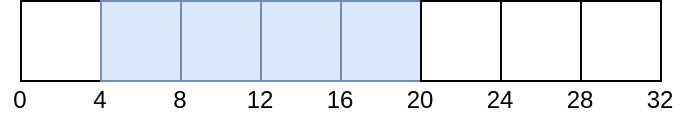
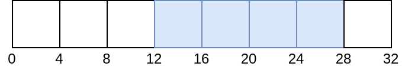
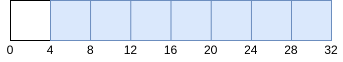
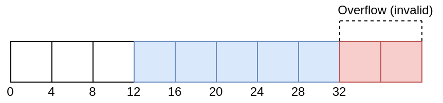

# 디스크립터 동적 오프셋

Vulkan은 바인드 시 오프셋을 조정할 수 있는 두 가지 유형의 디스크립터를 제공합니다. [스펙에서 정의됨](https://docs.vulkan.org/spec/latest/chapters/descriptorsets.html#descriptorsets-binding-dynamicoffsets):

- 동적 유니폼 버퍼 (`VK_DESCRIPTOR_TYPE_UNIFORM_BUFFER_DYNAMIC`)
- 동적 스토리지 버퍼 (`VK_DESCRIPTOR_TYPE_STORAGE_BUFFER_DYNAMIC`)

## 예제

아래 예제에서는 32바이트 크기의 버퍼를 사용하며, 이 중 16바이트는 `vkUpdateDescriptorSets` 시점에 설정됩니다. 첫 번째 예제에서는 동적 오프셋을 추가하지 않습니다.

```c
VkDescriptorSet descriptorSet; // 할당됨
VkBuffer buffer; // 32 바이트 크기

VkDescriptorBufferInfo bufferInfo = {
    buffer,
    4,      // 오프셋
    16      // 범위
};

VkWriteDescriptorSet writeInfo = {
    .dstSet = descriptorSet,
    .descriptorType = VK_DESCRIPTOR_TYPE_STORAGE_BUFFER_DYNAMIC,
    .pBufferInfo = bufferInfo
};

vkUpdateDescriptorSets(
    1,         // descriptorWriteCount,
    &writeInfo // pDescriptorWrites,
);

// 동적 오프셋 없음
vkCmdBindDescriptorSets(
    1,              // descriptorSetCount,
    &descriptorSet, // pDescriptorSets,
    0,              // dynamicOffsetCount
    NULL            // pDynamicOffsets
);
```

현재 버퍼의 상태는 다음과 같습니다:



다음으로, 바인드 시점에 8바이트 동적 오프셋이 적용됩니다.

```c
uint32_t offsets[1] = { 8 };
vkCmdBindDescriptorSets(
    1,              // descriptorSetCount,
    &descriptorSet, // pDescriptorSets,
    1,              // dynamicOffsetCount
    offsets         // pDynamicOffsets
);
```

현재 버퍼의 상태는 다음과 같습니다:



## VK_WHOLE_SIZE 예제

이번에는 범위에 `VK_WHOLE_SIZE` 값을 사용합니다. 위 예제와 거의 같지만 `VkDescriptorBufferInfo::range` 값만 달라집니다.

```c
VkDescriptorSet descriptorSet; // 할당됨
VkBuffer buffer; // 32 바이트 크기

VkDescriptorBufferInfo info = {
    buffer,
    4,             // 오프셋
    VK_WHOLE_SIZE  // 범위
};

VkWriteDescriptorSet writeInfo = {
    .dstSet = descriptorSet,
    .descriptorType = VK_DESCRIPTOR_TYPE_STORAGE_BUFFER_DYNAMIC,
    .pBufferInfo = bufferInfo
};

vkUpdateDescriptorSets(
    1,         // descriptorWriteCount,
    &writeInfo // pDescriptorWrites,
);

// 동적 오프셋 없음
vkCmdBindDescriptorSets(
    1,              // descriptorSetCount,
    &descriptorSet, // pDescriptorSets,
    0,              // dynamicOffsetCount
    NULL            // pDynamicOffsets
);
```

현재 버퍼의 상태는 다음과 같습니다:



이번에는 동적 오프셋을 적용하려고 시도하면 정의되지 않은 동작이 발생하며, [밸리데이션 레이어가 오류를 표시합니다](https://github.com/KhronosGroup/Vulkan-ValidationLayers/issues/2846):

```c
// 잘못된 사용 예시
uint32_t offsets[1] = { 8 };
vkCmdBindDescriptorSets(
    1,              // descriptorSetCount,
    &descriptorSet, // pDescriptorSets,
    1,              // dynamicOffsetCount
    offsets         // pDynamicOffsets
);
```

잘못된 동적 오프셋 적용 시 버퍼 상태:



## 제한 사항

`minUniformBufferOffsetAlignment` 및 `minStorageBufferOffsetAlignment` 값을 반드시 확인해야 하며, base offset과 dynamic offset 모두 이 제한 값의 배수여야 합니다.
